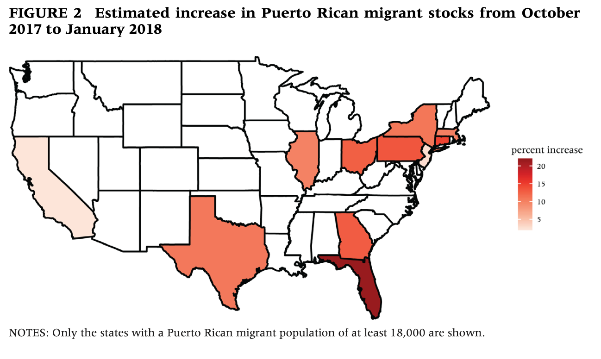
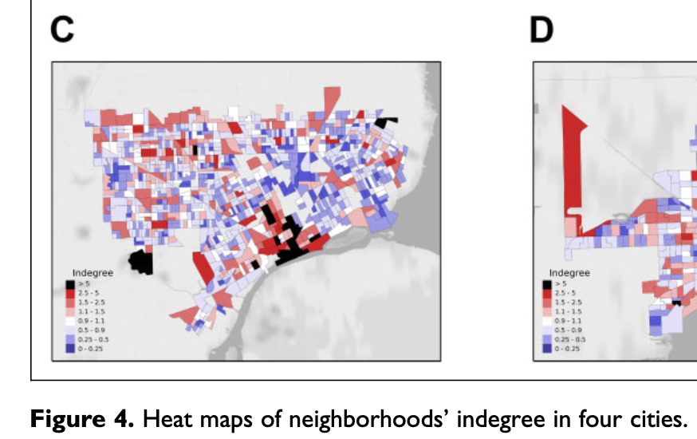
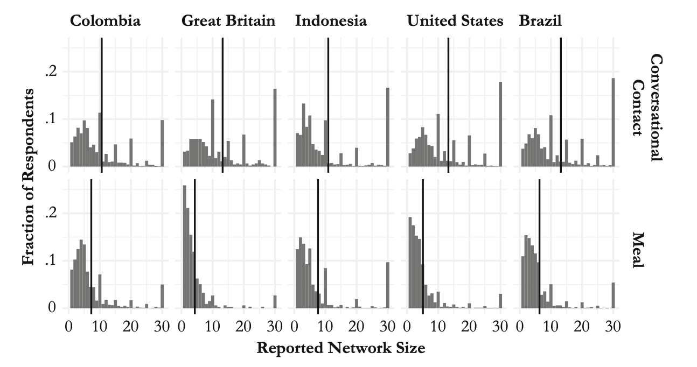

# About me

- Fifth-year PhD student in Sociology

- All of my research projects have involved digital data or data science in some form— 

  - **Gayborhood change:** I webscraped and geocoded an old digital archive of gay bars to identify gay neighborhoods
  
  - **Sexuality disclosure on Facebook:** "Reach" estimates from Facebook's advertising platform can proxy sexual orientation in the United States
  
  - **The Fragile Families Challenge:** A machine-learning competition on the FFCWS data had less amazing results than you might hope, but we learned some interesting things

---

# Demography and the data revolution

Emilio Zagheni (MPIDR) makes the argument that demography has been "data-driven" going back to John Graunt in the 16th century ... 

.center[]

... so it's not a surprise that demographers might be interested in new, digital sources of data.

.right[[Alburez-Gutierrez et al 2019]]

---

# Motivating examples

1. **Migration:** more current and transnationally consistent data about migrants

  .center[]
  
  .right[[Alexander et al 2019]]

2. **Residential mobility and segregation:** more detailed and accurate data about people's mobility, exposure, and opportunities

.right[[+ a few other topics]]

---

# Migration 

Digital data are especially useful for studying short-term or recent migration in response to shocks, before they've appeared in official statistics. Examples:

- out-migration from Puerto Rico after Hurricane María, using Facebook ads data (Alexander et al 2019)
- migrant flows from Venezuela in response to the humanitarian and economic crisis there, using geolocated Twitter data (Mazzoli et al 2020)

**Non-representativeness** is a major issue. Some of the most relevant statistical challenges are around validation and combining these data with existing sources ([PAA working paper from Zagheni et al](https://paa.confex.com/paa/2018/meetingapp.cgi/Paper/23641))

On a more theoretical level, Lee Fiorio (UW Geography) has a working paper using Twitter and mobile phone data to show estimates of migration flows between regions vary based on measurement. 

---

# Residential mobility and segregation

Phillips et al (2019) argue that geolocated Twitter data provide a more accurate measure of connectedness between neighborhoods based on mobility patterns, and thus a better measure of metro-level integration than measures of residential segregation alone. 

.center[]

Hess and Chasins (working paper, n.d.) scrape data from Craigslist to examine variation in Seattle rental markets. Ian Kennedy has used these same data to investigate how the *text* of these listings varies by the racial composition of neighborhoods.

---

# Other examples

Dennis Feehan (Berkeley Demography) administers surveys on Facebook to learn about offline populations (Feehan and Cobb 2019)

.center[]

Ridhi Kashyap et al (conference paper, 2017) use Google searches to "now-cast" sex ratios at birth in India

---

# Different kinds of data

### individual trace data

geolocated tweets, mobile phone records, Craigslist listings

### aggregate counts

Facebook ads reach estimates, derived estimates from individual data

---

# Ethics and other considerations

- IRBs don't consider most projects collecting digital trace data to be human subjects research

- But people aren't always comfortable being "participants" in e.g. Twitter research (Fiesler and Proferes 2018). They object less to aggregate data than to picking out individual users. (*Definitely* don't quote tweets verbatim in papers or presentations, for example!)

- It's also good to be aware of corporate policies and terms of service (TOS) for the websites and platforms you might use. But violating TOS may be warranted in some cases (see the court case [*Sandvig v Barr*](https://www.aclu.org/press-releases/federal-court-rules-big-data-discrimination-studies-do-not-violate-federal-anti))

- There's a certain strain of research that attempts to infer demographic characteristics (gender, race, age, even sexual orientation) from social media users' names, faces, or behaviors. There are strong critiques of this work, and I wouldn't recommend doing it. 

---

class: inverse, center, middle

# Question break

---

# Methods

*How do you gain access to demographic digital trace data?*

Two broad options, which boil down to: 

1. Convince someone else to give the data to you

2. Get the data yourself

---

# Convincing someone

This means collaborating directly with the corporations that collect, store, and own the data. 

Corporate collaborations are high risk, high reward, and require lots of economic or social capital. Examples: 

- [Social Science One](https://socialscience.one/our-facebook-partnership), a partnership between Facebook and a Harvard research team led by Gary King

- Some kinds of data, like **mobile phone** data, are only available through this sort of collaborative agreement (for good reason!)

- The same is true for **online dating** data ([Elizabeth Bruch's work](https://mhbsd.net/research/), for example)

As a graduate student, you probably can't do this, unless you find a faculty PI who already has some kind of agreement or access. 

---

# Getting the data yourself

*What **can** a graduate student do?*

### the "wild west" of webscraping

Web pages are written in HTML and CSS, which give them structure. 

Researchers can "scrape" particular elements from web pages with code; if many pages have the same structure, we can build a data set this way.

### the era of APIs

Web application programming interfaces (APIs) are a structured way for computers to talk to each other. They're how your web browser gets a web page in the first place.

Researchers can do this too: make a request (with the right parameters), get a response back (hopefully with data). Many major websites have public-facing APIs that researchers can use.

---

# The end of an era?

Freelon (2018) argues that we've entered the **"post-API age"**, as large companies like Facebook have clamped down on public access:

> The closure of the Pages API eliminated all terms of service (TOS)-compliant access to Facebook content. Let me underscore the magnitude of this shift: There is currently no way to independently extract content from Facebook without violating its TOS.  
>  
> At the flip of a metaphorical switch, Facebook instantly invalidated all methods that depended on the Pages API. For example, I gave a Facebook data collection workshop in January 2018 at the University of Michigan whose lessons are now mostly unusable....

One consequence is that webscraping is making a comeback

---

# Computational social science 

Outside demography, there's CSS research on culture, ideology, polarization, and many other topics

- in **political science** 
  - Rochelle Terman // https://plsc-31101.github.io/course/
  - Pablo Barberá // http://pablobarbera.com/POIR613/

- in **sociology** 
  - Matt Salganik & Chris Bail // SICSS
  - Kieran Healy // http://socviz.co/
  
CSS methods that haven't seen much use yet in demography include **crowdsourcing** and **text as data**

---

class: inverse, center, middle

# Question break

---

# Demo

https://ccgilroy.github.io/csss563-demo/demo.html

[download from https://github.com/ccgilroy/csss563-demo]

Contact info: cgilroy@uw.edu, @ccgilroy on Twitter

---

# References and further reading

.font60.pull-left[
Alburez-Gutierrez, Diego, Emilio Zagheni, Samin Aref, Sofia Gil-Clavel, André Grow, and Daniela Veronica Negraia. 2019. Demography in the Digital Era: New Data Sources for Population Research. preprint. SocArXiv.  

Alexander, Monica, Kivan Polimis, and Emilio Zagheni. 2019. “The Impact of Hurricane Maria on Out‐migration from Puerto Rico: Evidence from Facebook Data.” Population and Development Review 45(3):617–30.  

Cesare, Nina, Christan Grant, Quynh Nguyen, Hedwig Lee, and Elaine O. Nsoesie. 2018. “How Well Can Machine Learning Predict Demographics of Social Media Users?” ArXiv:1702.01807 [Cs].  

Cesare, Nina, Christan Grant, and Elaine O. Nsoesie. 2019. “Understanding Demographic Bias and Representation in Social Media Health Data.” Pp. 7–9 in Companion Publication of the 10th ACM Conference on Web Science. Boston Massachusetts USA: ACM.  

Cesare, Nina, Hedwig Lee, Tyler McCormick, Emma Spiro, and Emilio Zagheni. 2018. “Promises and Pitfalls of Using Digital Traces for Demographic Research.” Demography 55(5):1979–99.

Feehan, Dennis M., and Curtiss Cobb. 2019. “Using an Online Sample to Estimate the Size of an Offline Population.” Demography 56(6):2377–92.  

Freelon, Deen. 2018. “Computational Research in the Post-API Age.” Political Communication 35(4):665–68.  

]

.font60.pull-right[

Hess, Chris, and Sarah Chasins. n.d. “Estimating Neighborhood Rents with Scraped Data.” Retrieved May 10, 2020 (https://hesscl.com/smooth-sea/manuscript/index.html).

Mazzoli, Mattia, Boris Diechtiareff, Antònia Tugores, Willian Wives, Natalia Adler, Pere Colet, and José J. Ramasco. 2020. “Migrant Mobility Flows Characterized with Digital Data.” PLOS ONE 15(3):e0230264.  

Phillips, Nolan E., Brian L. Levy, Robert J. Sampson, Mario L. Small, and Ryan Q. Wang. 2019. “The Social Integration of American Cities: Network Measures of Connectedness Based on Everyday Mobility Across Neighborhoods.” Sociological Methods & Research.  

Salganik, Matthew J. 2017. Bit by Bit: Social Research in the Digital Age. Princeton University Press.  

Zagheni, Emilio, Venkata Rama Kiran Garimella, Ingmar Weber, and Bogdan State. 2014. “Inferring International and Internal Migration Patterns from Twitter Data.” Pp. 439–444 in Proceedings of the 23rd International Conference on World Wide Web, WWW ’14 Companion. New York, NY, USA: ACM.  

Zagheni, Emilio, Ingmar Weber, and Krishna Gummadi. 2017. “Leveraging Facebook’s Advertising Platform to Monitor Stocks of Migrants.” Population and Development Review.

]

